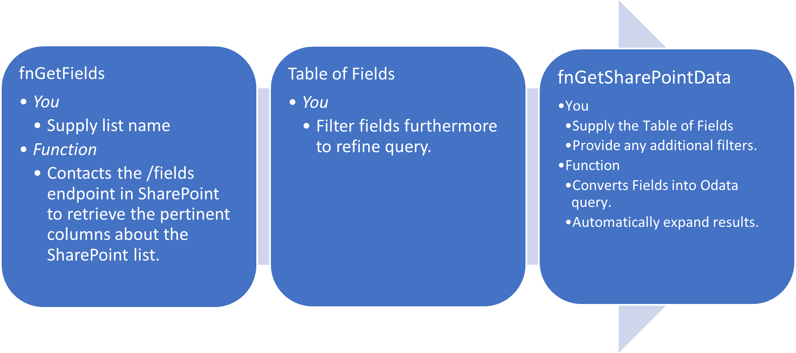
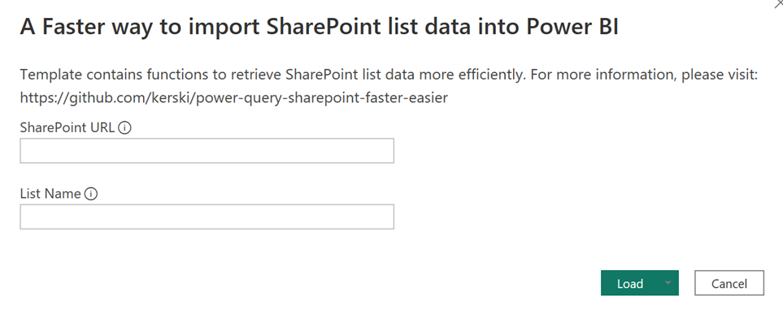
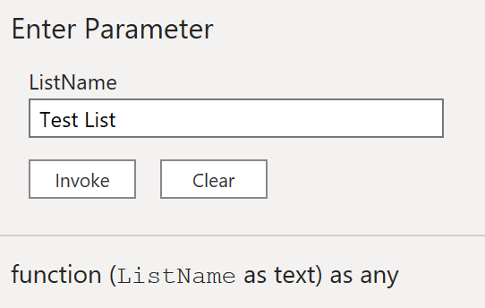
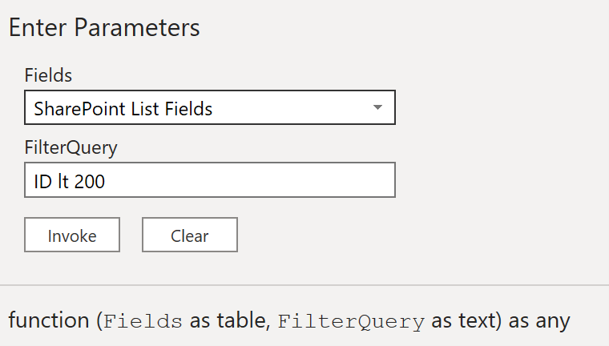
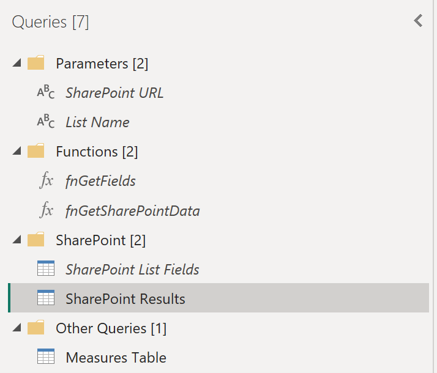
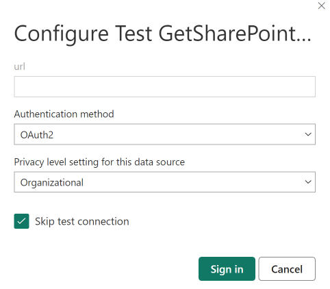
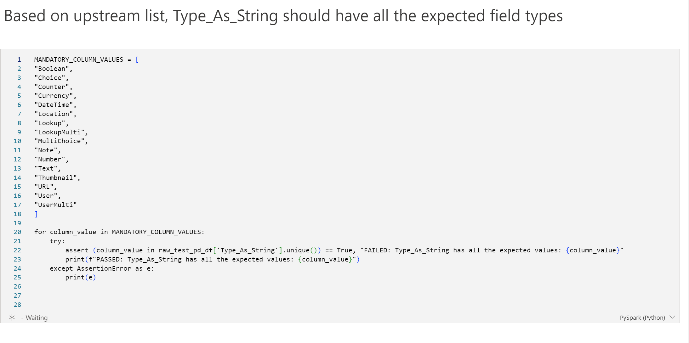

# A Faster (Easier?) way to import SharePoint list data into Power BI

If you're importing SharePoint lists into your Power BI model, you may
have experienced issues with existing connectors:

1)  The native v1 and v2 SharePoint list connectors are incredibly slow.
    I've seen refreshes take over two hours just to load multiple lists.
    This is often attributed to the "greediness" of the connector to
    pull all the columns (hidden and visible) into Power Query. The
    connectors aren't necessarily adhering to <a href="https://ssbipolar.com/2021/05/31/roches-maxim/" target="_blank">Roche's Maxim of Data Transformation</a>.

2)  The OData connector could be faster, but it requires you to learn
    the SharePoint API and understand how to querying the data. Learning
    how to use \$expand and how to identify the internal names to choose
    which columns to bring into the model can be cumbersome. I've had
    many of a tutorial session with co-workers on why a SharePoint
    column has an internal name with the characters "\_x0020\_" in it.

3)  The OData connector does not support relative URLs which makes
    parameterizing your workspace environments difficult.

Ultimately, we want a faster SharePoint connector that doesn't require
us to understand the SharePoint REST API.

This is repository aims to offer an alternative that is faster and easy
to use.

# How it works.

# Instructions

The following instructions introduces the connector using a Power BI
template file. You can use and copy the functions within this Power BI
file to other Power BI files to improve performance on your Power BI
refreshes.

1)  Download the latest Power BI template in the <a href="https://github.com/kerski/power-query-sharepoint-faster-easier/releases" target="_blank">release page</a>

2)  Enter the URL of the SharePoint site and name of the SharePoint list you wish to import.

*Figure 1 – First prompt when opening the template*

3)  Wait for the data to load (should be quick).

Okay, hopefully that was easy, but let's understand what's happening
under the hood.

## In-Depth

4)  Within the template, open Power Query

5)  As shown in Figure 4, you should see the following:

    - Parameters
        - SharePoint URL -- This is the URL of the site collection or
            site where the SharePoint list is located. This parameter is
            used in the functions and by having this as a parameter
            allows you to refresh this data in the Power BI Service
            using credentials. This parameter should not end with a
            forward slash ('/').

        - List Name -- This is the name of the SharePoint list you
            wish to import.

    - Functions

        - fnGetFields -- This function accepts a list name and will
            retrieve a curated list of columns from the SharePoint site.
            All custom columns from the SharePoint site are retrieved,
            along with the ID, Created, Created By, Modified, and
            Modified By fields. The additional columns that appear after
            calling this function are used to building the SharePoint
            REST API query, so you don't have to.
            
             
            *Figure 2- An example of calling the fnGetFields Function.*

        - fnGetSharePointData -- This function accepts the table of
    information produced by the fnGetFields function. All columns are
    expanded at least once with the Display Names. User and Lookup
    columns will need to be expanded manually. fnGetSharePointData also
    accepts a Filter query if you are familiar with OData and would like
    to filter rows of the SharePoint list before it is imported into
    Power BI. For example, if you needed to filter IDs less than 200 you
    would write "ID lt 200".
    
    *Figure 3 - Example of Calling fnGetSharePointData.*

    - SharePoint
        -  *SharePoint List Fields --* This hidden table is used to pass
        into the fnGetSharePointData function. You can filter the table
        further to restrict the number of columns that are retrieved.

        - SharePoint Results -- This is the actual extract of the
        SharePoint list based on the parameters supplied when calling
        the fnGetSharePointData function.

*Figure 4 - Power Query Setup for Template*

# Refreshing Data in the Service

If the Power BI Services, you'll need to set the credentials to use
OAuth2, set the privacy level to Organizational and choose "Skip test
connection".

*Figure 5- Example of how to setup the connection in the Power BI Service*

## Privacy Levels

If you receive the message "Formula.Firewall" (example below) with Power Query during a refresh, please update your privacy settings to ignore privacy levels and/or make sure the privacy settings are Organization for your connections.  Please keep in mind the security impact of ignoring privacy levels when combining with other data sources.

*Example of privacy setting error when using these functions*

If you are combining SharePoint data using this method, I would suggest
reading Matt Allington's article
(<https://excelguru.ca/power-query-errors-please-rebuild-this-data-combination/>)
to circumvent issues with merging this data with other sources.
Typically, you won't encounter this issue on your desktop, so it's best
to understand how to design your Power Query correctly to avoid this
issue in the Power BI Service.

## Testing

Leveraging Microsoft Fabric, the two functions fnGetFields.m and fnGetSharePointData.m are tested.  

The functions are tested against two SharePoint lists that are stores as templates in the <a href="./tests" target="_blank">test folder</a>.

1) MainListTestListTemplate.xml - This list called MainListTest contains many permutations of the list column types for testing.

2) LookupListTestListTemplate.xml - This list called LookupListTest is used by MainListTest to support lookup columns.

These functions are copied to a Dataflow 2.0 workflow in Microsoft Fabric and tests are ran in one or more Notebook artifacts.  

*Example of tests of M code using Fabric's Notebook artifact*
